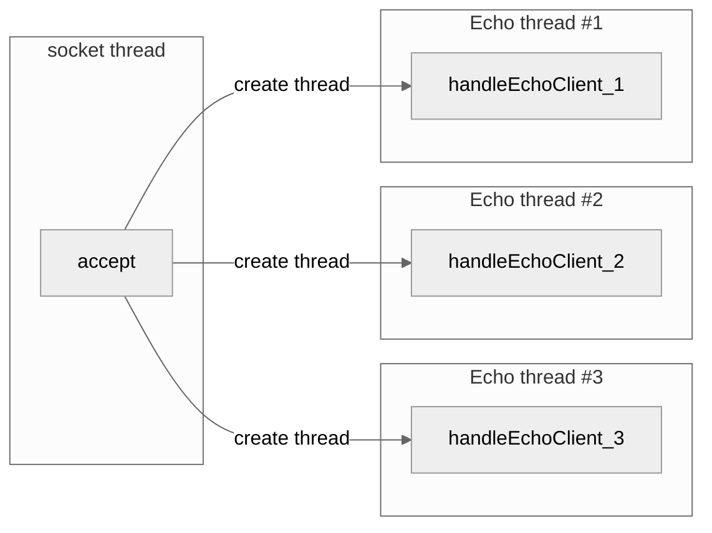

# 개요
앞서 기술한 Echo Server/Client에 대해 추가한 기능에 대해 기술 합니다.

---
# 변경점
1. 연결 유지
	- Echo를 한번만 수행한 뒤 연결을 종료하던 것을 연결을 계속 유지하여 Echo를 반복적으로 수행 할수 있도록 변경 하였습니다.
2. 다중 연결
	- 이전 버전에서는 한번에 한명의 유저만 접속 가능했던것을 여러명이 접속 가능하도록 변경 했습니다.
## Code
### Server Side
1. 연결 유지
	- Server 쪽에서는 연결을 유지 하기 위해 기존에 Echo 작업 이후 바로 Close 함수 호출 및 메소드 종료를 이용해 연결을 종료 시켰습니다.
		- 해당 로직을 for문으로 감싸여 종료 되지 않고 반복되도록 변경 시켜 연결이 유지되도록 하였습니다.
		- 기존의 bufio.NewReader.ReaderBytes를 쪼개어 for문 바깥에 Reader 클래스를 생성뒤 for 문 내에서 ReadBytes를 수행하도록 변경하여 불필요한 클래스 재생성을 방지 했습니다.
```golang
reader := bufio.NewReader(conn)
for {
	buf, err := reader.ReadBytes('\n')
	.
	.
	.
}
```
2. 다중 연결
	- Server 쪽에서는 다중 연결을 구현하기 위해서는 우선 소켓 연결을 하는 로직과 연결 이후 Echo를 수행하는 로직을 분리해서 수행하여야 합니다. 
		- Accept 함수 이후 handleEchoClient()를 수행하게 되면 앞서 언급한 연결 유지를 위해 for문으로 무한 루프가 수행중이기 때문에 기존의 socket의 Accept함수를 수행할수 없어 또 다른 소켓을 생성해야만 합니다.
		- Accept 수행 로직과 handleEchoClient(이하 메세지 로직)을 분리하기 위해서는 서로 다른 스레드로 각 로직을 수행해야 합니다.
		- 또한 Accept 함수를 재사용하기 위해 Accept 수행 로직을 for문으로 반복 시켜야 합니다.
```golang
for {
	conn, err := listener.AcceptTCP()
	if err != nil {
		fmt.Println("Error occurred : s%", err.Error())
	}
	fmt.Printf("Client %s Connected\n", conn.RemoteAddr().String())

	go handleEchoClient(conn)
}
```

### Client Side
1. Connection 유지
```golang

```


# 코드

## Echo Server

```golang
package main

import (
	"bufio"
	"fmt"
	"net"
	"strings"
)

func main() {
	fmt.Println("Start Socket Practice Server")

	addr := "0.0.0.0:18080"
	tcpAddr, err := net.ResolveTCPAddr("tcp4", addr)
	if err != nil {
		fmt.Println("Error occurred : ", err.Error())
	}

	listener, err := net.ListenTCP("tcp", tcpAddr)
	if err != nil {
		fmt.Println("Error occurred : s%", err.Error())
	}

	for {
		conn, err := listener.AcceptTCP()
		if err != nil {
			fmt.Println("Error occurred : s%", err.Error())
		}
		fmt.Printf("Client %s Connected\n", conn.RemoteAddr().String())

		go handleEchoClient(conn)
	}
}

func handleEchoClient(conn net.Conn)  {
	defer fmt.Printf("client %s is Close\n", conn.RemoteAddr())
	defer conn.Close()

	reader := bufio.NewReader(conn)
	for {
		buf, err := reader.ReadBytes('\n')

		if err != nil {
			fmt.Println("Error occrured : s%", err.Error())
			conn.Close()
			return
		}

		msg := string(buf[:])
		fmt.Println("Receive Msg " + conn.RemoteAddr().String() +" : ", msg)
		conn.Write(buf)

		if strings.EqualFold(msg, "exit\n") {
			return
		}
	}

}
```

## Echo Client

```golang
package main

import (
	"bufio"
	"fmt"
	"net"
	"os"
	"strings"
)

func main()  {
	fmt.Println("Start Socket Practice Client")

	addr := "localhost:18080"

	conn, err := net.Dial("tcp", addr)
	if err != nil {
		fmt.Println("Error occurred : s%", err.Error())
	}

	for {
		fmt.Println("Input Msg : ")
		data, err := bufio.NewReader(os.Stdin).ReadString('\n')
		if err != nil {
			fmt.Println("Error occurred : s%", err.Error())
		}

		// write the data to the connection
		fmt.Fprintf(conn, data)

		recv, err := bufio.NewReader(conn).ReadString('\n')
		if err != nil {
			fmt.Println("Error occurred : s%", err.Error())
		}

		fmt.Println("Receive Echo : ", recv)

		if strings.EqualFold(recv, "exit\n") {
			fmt.Println("Exit")
			conn.Close()
			break
		}
	}
}
```